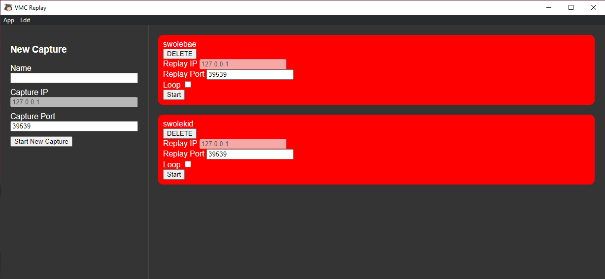

# vmc-replay
Record and replay vmc interaction. Can also loop them.

## How to install

Go to [the releases page](https://github.com/swolekat/vmc-replay/releases) and find the latest release. Download the .exe file and run it. The app will be installed.

## How to use
There are two primary modes of use: recording and replaying.

### To record
All the recording functions are handled on the left side. You need to name it and enter a capture port. When you stop capturing all the packets are saved to `APPDATA/LocalLow/swolekat/vmc-replay/`.  

### Replaying 
On the right side you can play back the file. If you check the Loop checkmark it'll continuously play back the packets. If you press start it'll just play it back once. The delete button will delete the file. 

## Support
This project is free for anyone to use and update. If you need to contact me specifically, stop by my stream at http://twitch.tv/swolekat or leave an issue on github. 